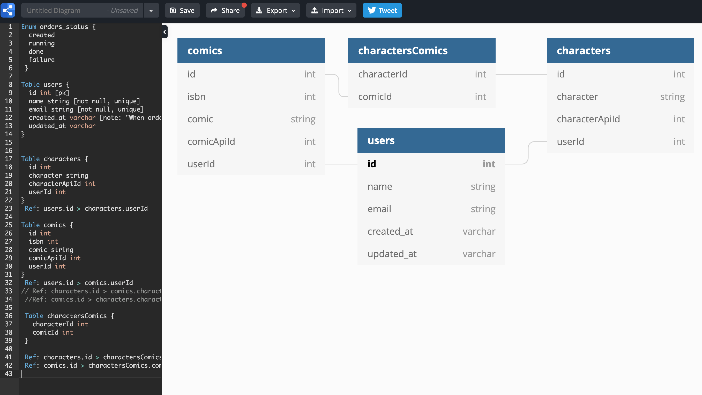

# Tech Used

Express authentication template using Passport + flash messages + custom middleware
Express_ejs 
MD5 to build a hash for Marvel API
Axios pulled the data from the API 
## Getting Started

#### Scaffold w/tests (see `master` branch)

* Run `npm install` to install dependencies
  * Use `npm run lint:js` to lint your JS
  * Use `npm run lint:css` to lint your CSS
  * Use `npm test` to run tests
* Setup the databases
  * Change the database names in `config/config.json` to reflect your project
  * Run `createdb project_name_development` to create the development database
  * Run `createdb project_name_test` to create the test database


* Run `npm install` to install dependencies
  * Use `npm run lint:js` to lint your JS
  * Use `npm run lint:css` to lint your CSS
  * Use `npm test` to run tests
* Setup the databases
  * Run `createdb express_auth_development` to create the development database
  * Run `createdb express_auth_test` to create the test database
  * Run `sequelize db:migrate` to run migrations

#### Routes

Created a marvel folder to hold all the necessary routes. 


**This is the route that that imports the API by character to the show page** 

```
router.get('/show/:characterName', function(req, res) {
  console.log(req.params.characterName)
  var url = buildMarvelQuery('characters?name=' + encodeURI(req.params.characterName) + '&'); 
  axios.get(url).then(function(apiResponse) {
    var character = apiResponse.data.data.results[0];
    res.render('marvel/show', { character });
  }).catch( err => console.log(err));
});
```
**Post route is posting one instance of that favorite hero to your favorites page with the user specific Id**

```
router.post('/favorites', function(req, res) {
  db.character.findOrCreate({
    where: {
      character: req.body.character,
      userId: req.user.id
    }
  }).spread(function(character, created){
      if (character) {
        console.log('character found')
    } else {
        console.log('character created')
    }
  }).then(function() {
    res.redirect('/marvel/favorites', {character});
  });
});
```
**Route is users favorite page that allows you to view your favorites**
```
router.get('/favorites', function(req, res) {
  db.character.findAll({
    where: {
      userId: req.user.id
    }
  }).then(function(character) {
    res.render('marvel/favorites', {character});
  });
});
```
**Route shows individual character information**
```
router.get('/show', function(req, res) {
  db.character.findOne().then(function(character) {
    res.redirect('/show', {character});
  });
});
```
**Route allows user to view character information through the show page**
```
router.get('/favorites/:id', function(req, res){
  db.character.findByPk(req.params.id).then(function(character){
    var url = buildMarvelQuery('characters?name=' + encodeURI(character.name)); 
    axios.get(url).then(function(apiResponse) {
      var character = apiResponse.data.data.results;
      res.render('marvel/show', { character, id: parseInt(req.params.id)});
    });
  });
});
```
**Route Deletes characters from users favorites**
```
router.delete('/favorites/:id', function(req, res) {
  db.character.destroy({
    where: {id: parseInt(req.params.id)}
  }).then(function(character) {
    res.redirect('/marvel/favorites');
  });   
});
```
**Exports module the index.js page**
```
module.exports = router;
```

#### DB Diagram

[Database](https://dbdiagram.io/d)



#### Middleware
**Created this middleware to be able to access the necessary information that I wanted the user to be able to get**
**For the marvel API I had to use there base url + the param + timestamp + apiKey (publicKey) + hash**
**hash needed md5 because you had to hash the timestamp + privateKey + publicKey** 

```
require('dotenv').config();
const md5 = require('md5');
const publicKey = process.env.PUBLIC_HERO_KEY;
const privateKey = process.env.SUPER_HERO_SECRET_KEY; 

function buildMarvelQuery(param) {
  let baseUrl = 'http://gateway.marvel.com/v1/public/' +  param;
  let ts = md5(new Date().toString());
  let apikey = publicKey;
  let hash = md5(ts + privateKey + publicKey);
  return baseUrl + 
         'ts=' + ts +
         '&apikey='+ apikey +
         '&hash=' + hash
        // + '&limit=20';
}

module.exports = buildMarvelQuery;
````
